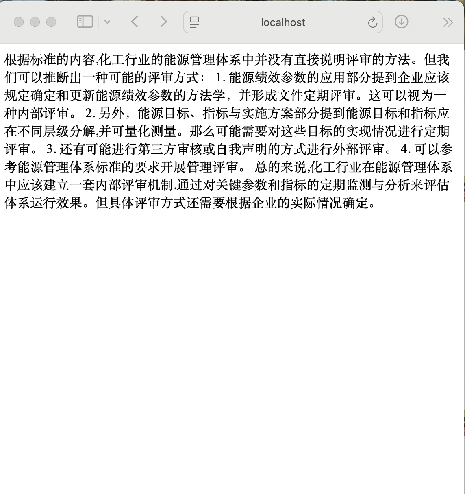

# Ollama 安装
- [Download and install Ollama](https://ollama.com/download)
# 安装千问模型
- ollama pull qwen2.5
# Chroma 安装与运行
- docker run -it --rm --name chroma -p 8000:8000 ghcr.io/chroma-core/chroma:0.6.2
# 运行程序
- mvn spring-boot:run -DskipTest
# 提问
- 未使用QuestionAnswerAdvisor：http://localhost:8081/qa?question=化工行业能源管理体系是如何评审的
- 使用QuestionAnswerAdvisor：http://localhost:8081/ask?question=化工行业能源管理体系是如何评审的
# 响应
- 
- 如果想通过idea IDE启动，可以配置
