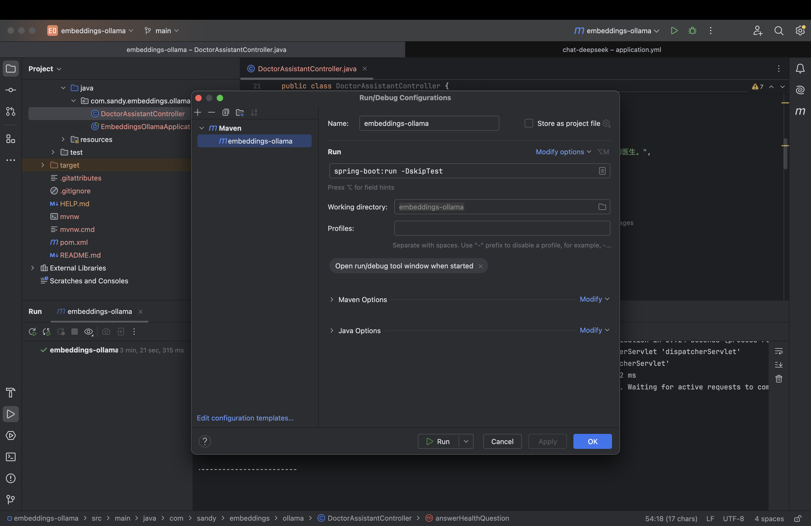
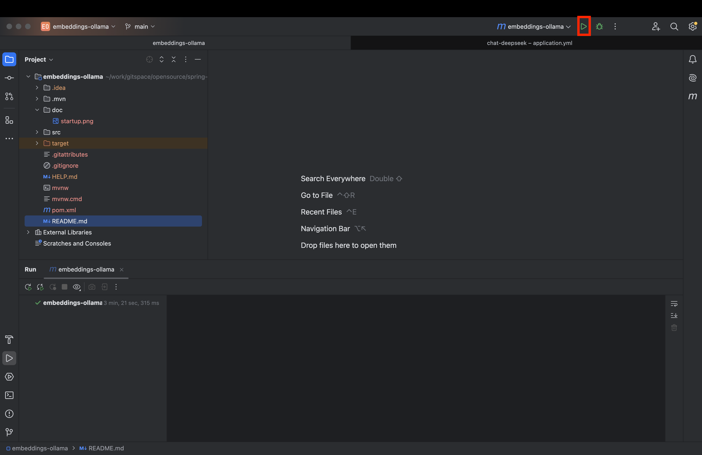

# 场景描述
假设我们正在开发一个医生助手，用户输入“自己肚子疼怎么办”，系统会：
- 1.使用 EmbeddingModel 从医疗知识库中检索与“肚子疼”相关的建议或信息。 
- 2.使用 ChatModel 根据检索到的信息生成自然语言的回答，例如可能的缓解方法或建议。

我们继续使用 Spring AI 的 Ollama 实现（OllamaEmbeddingModel 和 OllamaChatModel），并假设本地已运行 Ollama 服务。

# 假设数据
我们有一个简单的医疗知识库（存储在内存中，实际应用中可能用向量数据库）。文档如下：
- 文档1：“肚子疼可能是消化不良引起的，可以尝试喝点温水或吃点清淡的食物。如果持续疼痛，请咨询医生。” 
- 文档2：“腹痛如果伴随发热，可能是感染，建议尽快就医。” 
- 文档3：“背痛可能是肌肉拉伤引起的，可以尝试休息和热敷。”

# 安装Ollama
- 在您的本地机器上[下载并安装Ollama](https://ollama.com/download)
- 您可以从Ollama模型库中提取您想在应用程序中使用的模型：
  ollama pull qwen2.5
# 启动程序
- 配置启动信息

- 启动程序

# 示例运行
- 请求：GET /doctor-assistant?question=自己肚子疼怎么办 
- 响应："肚子疼可能是消化不良引起的，建议您喝点温水或吃点清淡的食物。如果疼痛持续，请咨询医生。"
- 请求：GET /doctor-assistant?question=肚子疼还有发热怎么办 
- 响应："腹痛伴随发热可能是感染引起的，建议您尽快就医以获得专业诊断和治疗。"
- 请求：GET /doctor-assistant?question=头晕怎么办 
- 响应："抱歉，我无法提供针对您问题的具体建议，请咨询专业医生。"（因为知识库中没有匹配的文档）

# 代码工作流程
## 1.初始化嵌入向量：
- 在构造函数中，使用 EmbeddingModel 为知识库中的每个文档生成嵌入向量，存储在 documentEmbeddings 中。

## 2.处理用户问题：
- 用户通过 /doctor-assistant?question=自己肚子疼怎么办 发送请求。 
- EmbeddingModel 计算问题“自己肚子疼怎么办”的嵌入向量。

## 3.检索相关文档：
- 使用余弦相似度找到与问题最匹配的文档，例如“肚子疼可能是消化不良引起的，可以尝试喝点温水或吃点清淡的食物。如果持续疼痛，请咨询医生。”

## 4.生成回答：
- 将检索到的文档和问题组合成提示，交给 ChatModel。 
- ChatModel 生成自然语言回答，例如“肚子疼可能是消化不良引起的，建议您喝点温水或吃点清淡的食物。如果疼痛持续，请咨询医生。”

