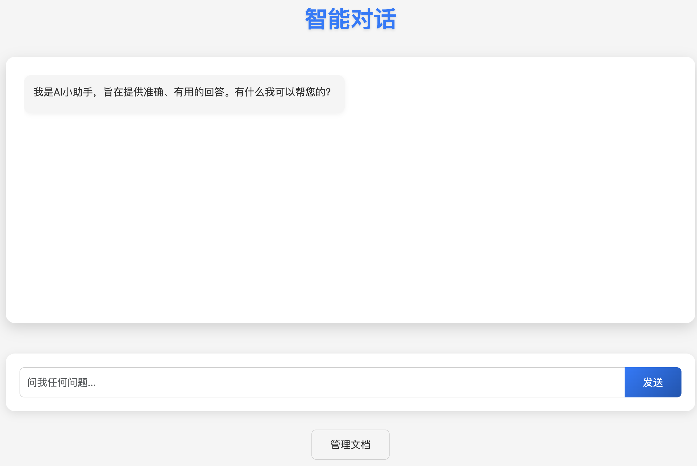
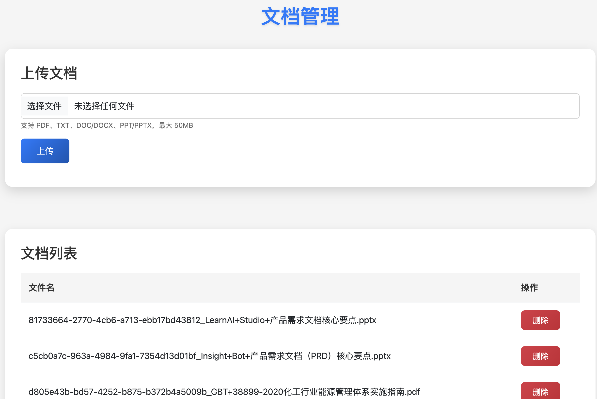

# 简介
本Demo主要应用了Spring的ETL Pipeline组件和Retrieval Augmented Generation (RAG)组件，
实现了多种文档，如： PDF、TXT、DOC/DOCX、PPT/PPTX等的文件上传与管理，并基于这些文档里的内容，对用户提出的问题，进行回答
# 应用场景
可以直接做成一个小知识库，同时，可以做其他大模型应用的文档管理功能
# 智能对话

# 文档管理
