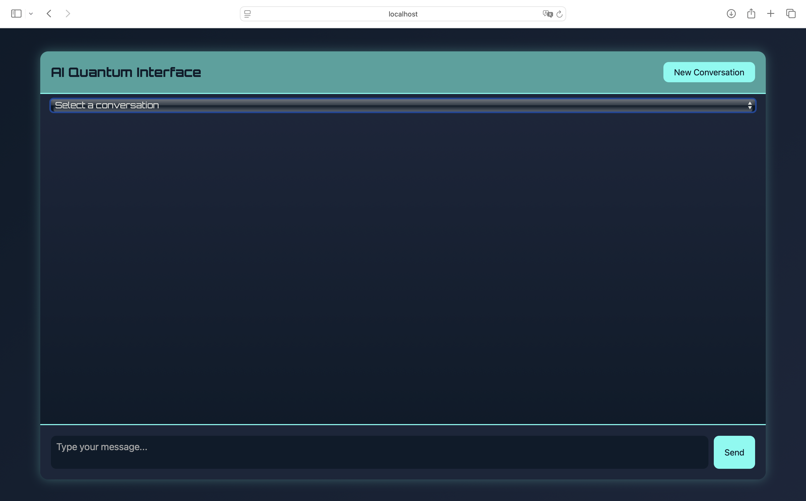

### 简介
通过这个小demo，想让大家学习到Spring AI如何实现记忆功能和流式输出，发现记忆功能非常重要，可以和程序进行多轮沟通，寻求更好的答案
# Ollama 安装
- [Download and install Ollama](https://ollama.com/download)
# 安装千问模型
- ollama pull qwen2.5
# 运行程序
 MemoryLlamaApplication
# 访问
http://localhost:8081/
即可进行多轮对话

