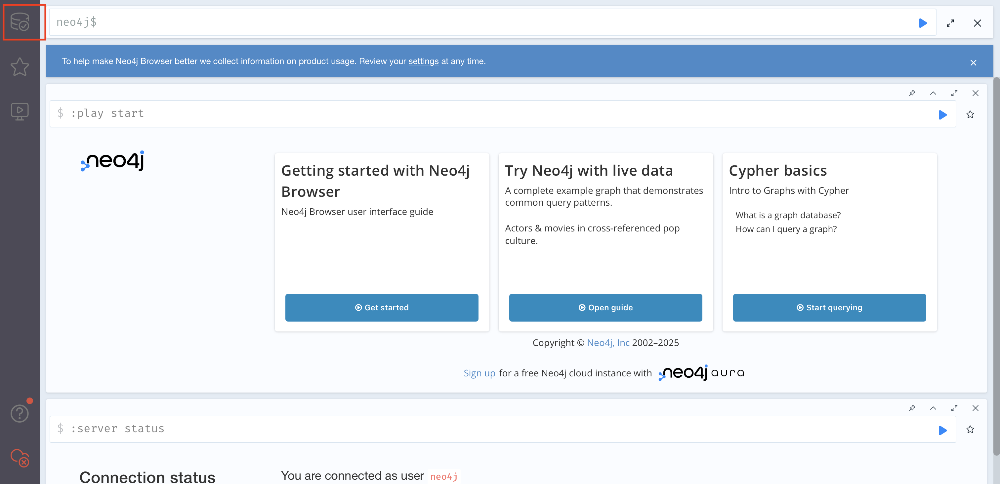
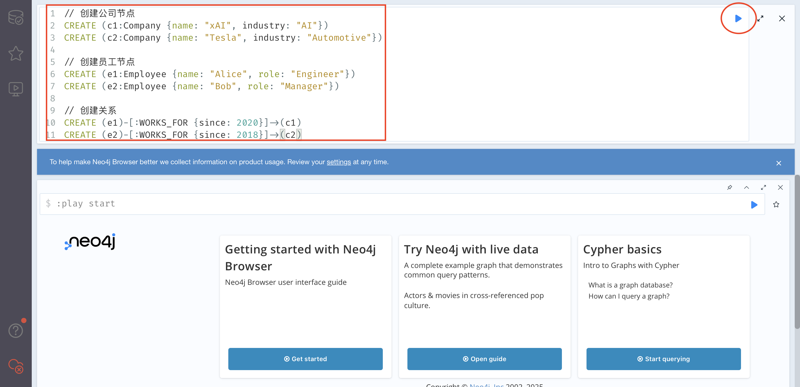
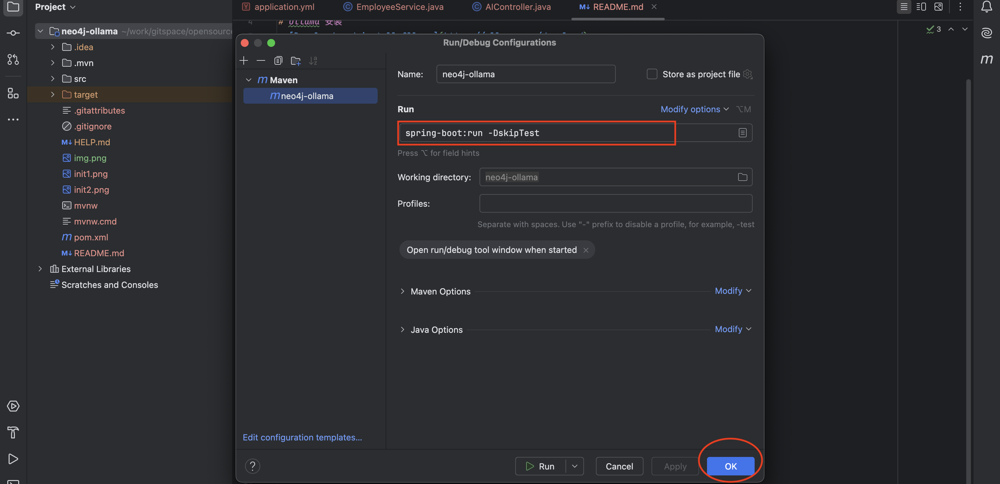

# 这个应用是做什么的 

这是一个GraphRAG的例子，也就是用图知识库或者说知识图谱，增强大模型问答能力的例子，本例子用Neo4j做图数据存储，形成知识图谱，然后基于Spring AI框架，在提问时，调用大模型时，进行rag增强。
# Ollama 安装
 [Download and install Ollama](https://ollama.com/download)
# 安装千问模型 
 ollama pull qwen2.5
# 安装Neo4j
docker pull neo4j:5.18.0
# 运行Neo4j
docker run -d \                                     
--name neo4j \
--platform linux/arm64 \
-p 7474:7474 -p 7687:7687 \
-e NEO4J_AUTH=neo4j/your_password \
neo4j:5.18.0
# 初始化Neo4j
- 访问： http://localhost:7474
- 输入账号/密码：neo4j/your_password
- 选择数据库

- 初始化数据

// 创建公司节点
CREATE (c1:Company {name: "xAI", industry: "AI"})
CREATE (c2:Company {name: "Tesla", industry: "Automotive"})

// 创建员工节点
CREATE (e1:Employee {name: "Alice", role: "Engineer"})
CREATE (e2:Employee {name: "Bob", role: "Manager"})

// 创建关系
CREATE (e1)-[:WORKS_FOR {since: 2020}]->(c1)
CREATE (e2)-[:WORKS_FOR {since: 2018}]->(c2)

# 配置idea，并运行

