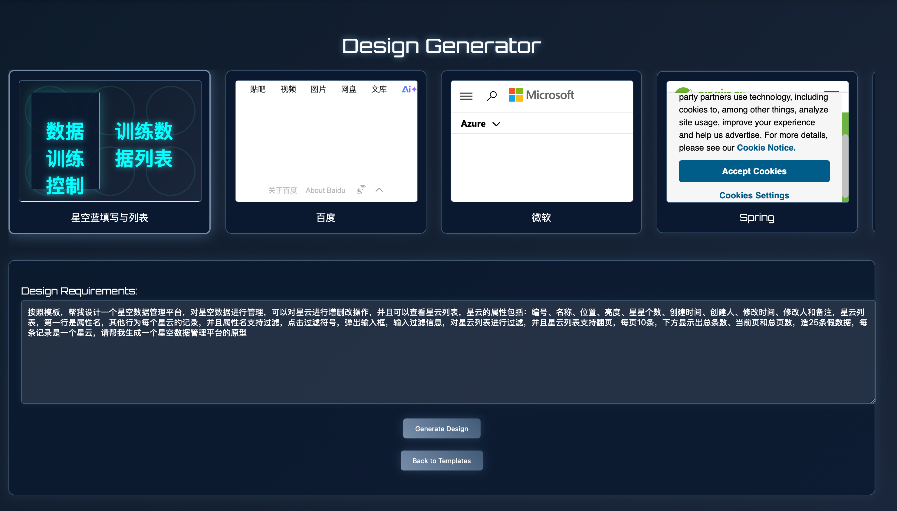

# 简介
本Demo主要基于Spring AI+Azure OpenAI/DeepSeek/Ollama，实现通过自然语言，基于模板，生成原型设计，让产品经理或者BA可以按照自己的想法生成原型
# 应用场景
解决方案人员、产品经理，可以按照自己的想法，快速生成原型
# 支持大模型
## DeepSeek
- application.yml ai.openai.chat.enabled=true
```
  ai:
    openai:
      chat:
        enabled: true
```
- 环境变量配置
```
SPRING_AI_OPENAI_API_KEY=你的deepseek的key
SPRING_AI_OPENAI_BASE_URL=https://api.deepseek.com
SPRING_AI_OPENAI_CHAT_MODEL=deepseek-chat
```
## Alibaba
- application.yml ai.dashscope.chat.enabled=true
```
  ai:
    dashscope:
      chat:
        enabled: true
```
- 环境变量配置
```
BL_API_KEY=你的Alibaba的百炼平台的key
```
## azure
- application.yml ai.azure.openai.chat.enabled=true
```
  ai:
    azure:
      openai:
        chat:
          enabled: true
```
- 环境变量配置
```
AZURE_OPENAI_API_KEY=你的Azure的openai的key
AZURE_OPENAI_ENDPOINT=你的endpoint
```
## ollama
- application.yml ai.ollama.chat.enabled=true
```
  ai:
    ollama:
      chat:
        enabled: true
```

# 生成原型

并支持调整设计
# 输入自己的原型想法

# 参考模板
